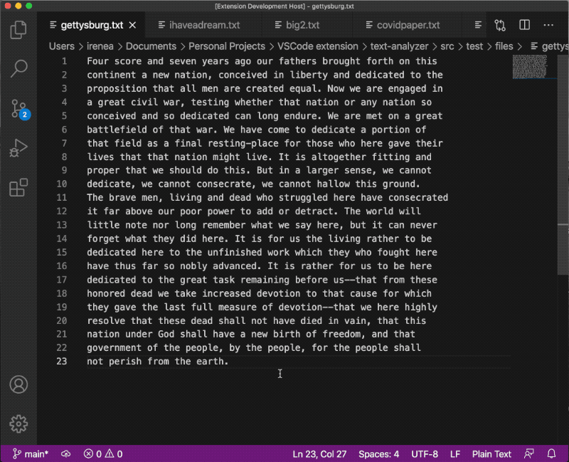
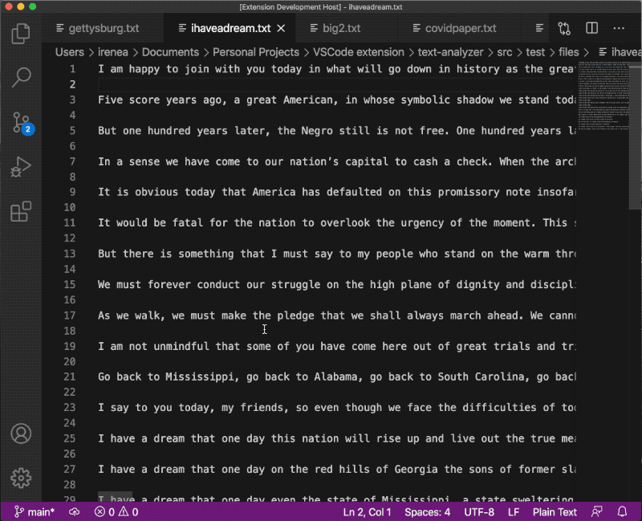
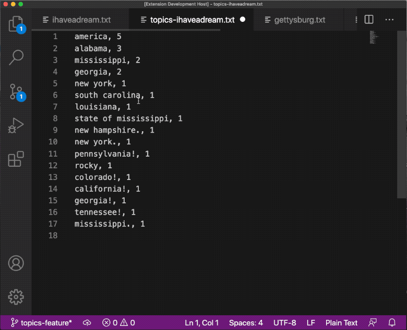
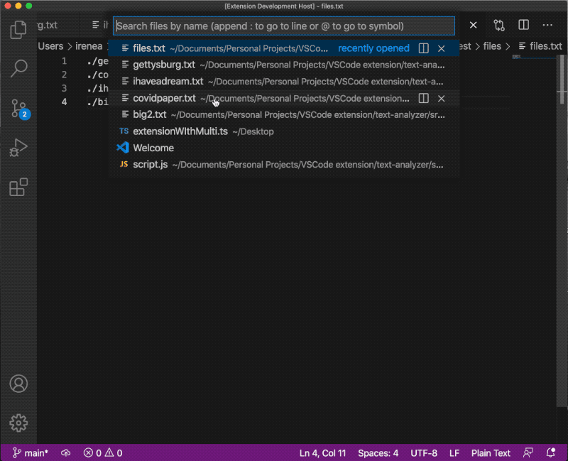

# Text Analyzer

This VSCode extension provides basic natural language processing utilities for text files.

It includes:

* **Frequent words**: ability to extract the most frequent words in a document
* **Ngrams**: ability to extract arbitrary number of ngrams
* **Frequency–inverse Document Frequency (TfIdf)**: ability to perform tfidf on a set of documents. Essentially finds the most common unique words in each document.

## Features (Commands)

For each of these commands, you can open the Command Pallete, then type '>' and the command.

### Frequent Words

Called `Text Analyzer: Frequent Commands`: this command will apply a most frequent word analysis to a text file.

You have the option of providing the source file as the current file in the editor or thorugh a file picker. 

A new text file is created in the same directory with the results.



### Ngrams

Called `Text Analyzer: Ngrams`: this command will apply a ngram analysis to a text file.

You have the option of providing the source file as the current file in the editor or thorugh a file picker. 

A new text file is created in the same directory with the results.



### Topics

Called `Text Analyzer: Topics`: this command will extract topics (entities like places, people, and organizations) from a text document.

You have the option of providing the source file as the current file in the editor or thorugh a file picker. 

A new text file is created in the same directory with the results.



### TfIdf

Called `Text Analyzer: Frequency–inverse Document Frequency (tfidf)`: this command will apply a most tfidf analysis to a set of text files provided through a *source file*.

The *source file* be a list of files to run through the tfidf analysis. The path of those files should be relative to the source file. An example:

```
./gettysburg.txt
./covidpaper.txt
./ihaveadream.txt
./big2.txt
```

A tfidf command applied on this *source file* will parse through all four documents and include them in the tfidf analysis.

Like the other commands you have the option of providing the source file as the current file in the editor or thorugh a file picker. 

A new text file is created in the same directory with the results.



## Develop

To develop for this extension: `yarn install`.

## Testing

There are two testing configurations:

1. **Run Extension**: opens a set of test files on top of which one can run all of the commands.
2. **Extension Tests**: runs automated end to end tests on each command.

## Known Issues

* **Large files**: Very large text files don't load properly to VSCode (test with `./src/test/files/big.txt`). Probably have to look into VSCode memory limitations on input.
* **Error handling and testing**: Need more robust error handling (espeiclaly on the file input side) and more testing. Cut corners here for the sake of time.
* **File input**: Likely would be some errors around encodings that I haven't explored

## Potential improvements

* **Handling multiple file inputs**: Could expand file picker to handl multiple files
* **More NLP features**: Could hook into fancier NLP services like google cloud to do fancier semantic anaysis, syntax analysis, entity extraction, etc. 
* **Expanded UI**: Could explore other forms of UI inputs
* **Expanded output options**: Could explore more outputs beyond opening a new text file with the results (csv files, terminal output, webviews, etc)
* **More languages**: expand beyond English


## Testing sources

Can be found in `/src/test/files`.

* [covidpaper.txt](https://iris.paho.org/bitstream/handle/10665.2/53057/v44e1492020.pdf?sequence=1&isAllowed=y)
* [gettysburg.txt](https://www.artofmanliness.com/articles/the-35-greatest-speeches-in-history/#Abraham_Lincoln_the_Gettysburg_Address)
* [ihaveadream.txt](https://www.huffpost.com/entry/i-have-a-dream-speech-text_n_809993)
* [big.txt](https://norvig.com/big.txt)
* big2.txt: a subset of big.txt
* files.txt: custom file